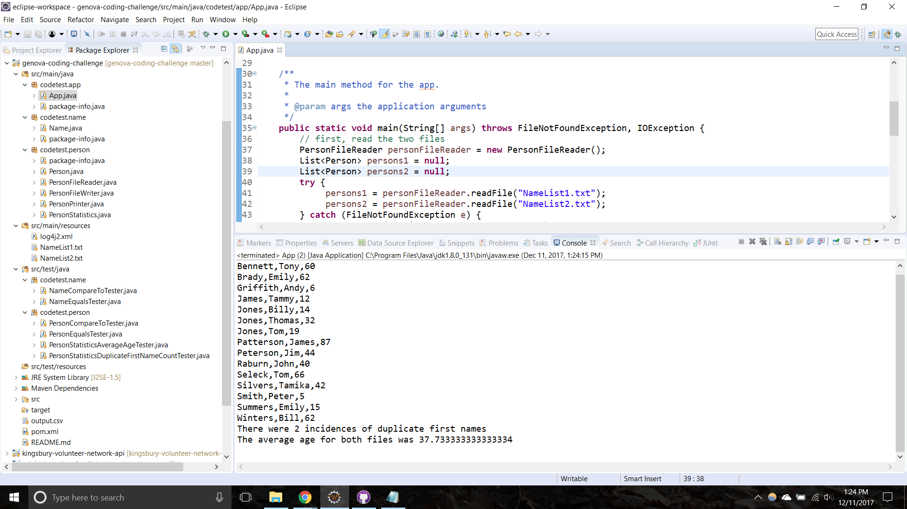

# genova-coding-challenge

## Instructions
This project uses Maven. To run the project:
1. Clone this repo
1. In Eclipse, select File > Import > Existing Maven Project. Navigate to the directory of the cloned pom.xml file
1. Once imported, simply right click on the ```App.java``` class and click Run As > Java Application

## Assumptions Made
1. The files to read will reside in the ```/resources``` directory of the project. If required, this project may be modified to create an executable JAR and allow the user running the JAR to specificy the file location(s). As that was not in the specifications, the internal ```/resources``` assumption was made.
1. The output location is the project's root directory, and the file generated is named ```output.csv```.

## Notes
* Java Version: 7
* IDE: Eclipse Oxygen

## Sample Ouput

